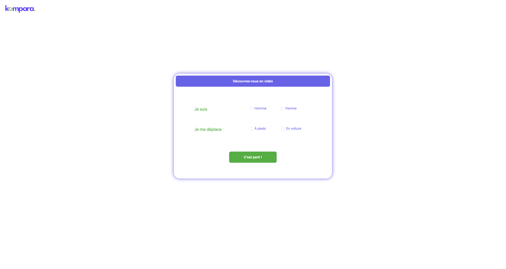
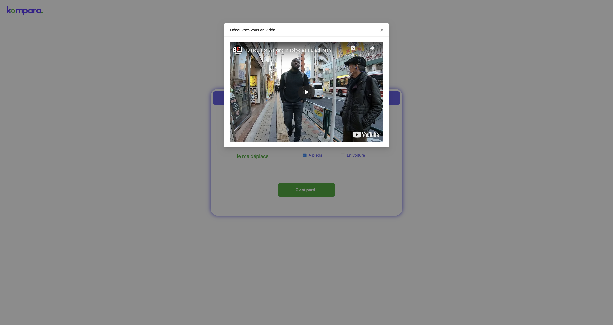
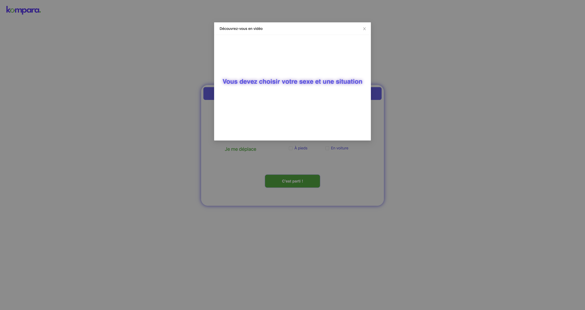
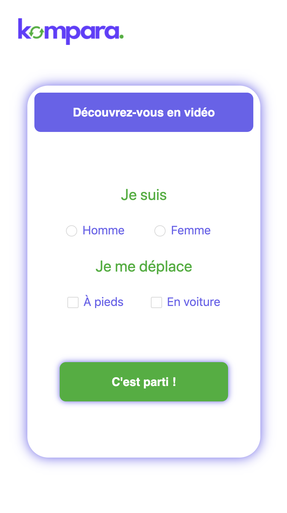

> # Kompara

kompara is a digital service for personalized advice on international money transfers. It is both a trusted partner of money transfer companies and of their customers, users of the sending services.

 <hr>

> # Description About The Project

This projet is a recruitment test from kompara trying on it to develop a responsive web page design .

<hr>

> # Completion Time

About one day

<hr>

> # Front-end

- React.js (+hooks)
- antd
- css

<hr>

> ### How to run it ?

1.  cd client && npm install

2.  cd client && npm run Product

3.  Open browser and go to `http://localhost:3000`

<hr>

> # Screenshots

# Full Screen

```
Home
```



```
Video
```



```
Error
```



# Responsive

```
Home
```



```
Video
```


<hr>
